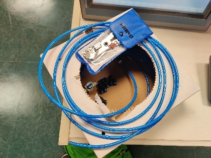
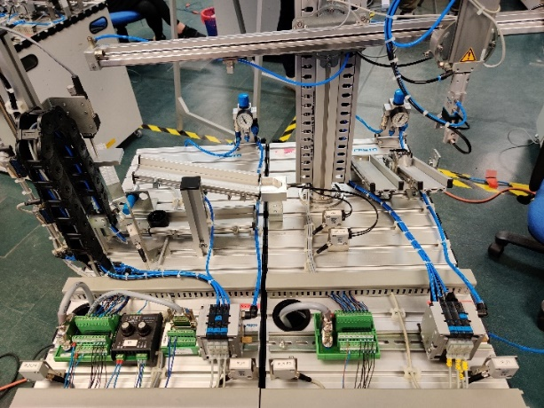

# **1M20504 WSS: Mechatronics Project**

**Abstract**

*This project is aimed at programming Festo's Learning Systems, Factory
automation and Industry 4.0.CoDeSys and TIA Portal were used to program
the MPS PLC. Global Variables or tags were used to declare the inputs
and outputs. Programming is achieved by using Structured Text as the
programming language. HMI is used as the primary Visualization for
Siemens.*

# INTRODUCTION

## Background

Festo's training Modular Production System (MPS) is primarily used to
foster skills and knowledge development in mechatronics and factory
automation. It has been used in World Skills Competition for
mechatronics championship since 1991. It is part of the innovative
training solutions for Industry 4.0. The available programming software
available are "CoDeSys", "Step 7" and "Logo! Soft Comfort".

## Objectives

The project's objective was to learn about Festo's training Modular
Production System, from the old production system used in the
competition, to the new Industry 4.0. The older system uses CoDeSys to
program the Festo's Programmable Logic Controller (PLC). The newer
system uses siemens TIA Portal and Programmable Logic Controller (PLC).

The specific objectives were to:

-   Research and read up the documentation on Festo's Modular Production
    System along with Tutorial Videos on YouTube.

-   Discover and Explore Structured Text Programming online using
    Google.

-   Come to Lab for training on Mechanical and Programming.

-   Disassembly and Reassembly of the Distribution station mechanically
    and pneumatically.

-   Equip the station with pneumatic tubing from the wall.

-   Enable Communication between the Programmable Logic Controller
    (PLC), Computer and the Modular Production System (MPS) by using LAN
    Communication through a Network Switch.

-   Differentiate between the Outputs and Inputs and Declare the
    variables -- I (Inputs), Q (Outputs).

-   Program using the interface provided by CoDeSys and TIA Portal.

-   Investigate the differences between the Current and Older Modular
    Production System.

-   Sequence the Reset and Start Sequence.

-   Enhance on the program when the station is occupied.

-   Program the Blinking LED's and function on the Control Board, Start
    and Reset Button.

-   Combine the program to produce a line of functioning stations.

-   Verify if the stations are working as described.

-   Program, Design and Visualize the HMI Controller.

The process of the project runs though Research, Plan, Training,
Self-Learning and Practice. These steps are needed to transition between
the old Modular Production System used in WSS to the newer Industry 4.0
System.

## PROJECT DESCRIPTION

### Modular Production System

There are seven stations used in the World Skills Singapore (WSS)
Competition. Distributing, Testing, Processing, Handling, Sorting, Pick
Place and Fluid Muscle Press. There is one mechanic and one programmer
assigned and trained for the competition. The mechanic mainly
specializes with the stations while the programmer programs the Reset
and Start sequence for these seven stations. These stations are mainly
used for competition, but it can also be used for training.

#### Distribution and Testing Station

> 
> 
>
> **Figure 1:** Single Distribution Station **Figure 2:** Single Testing
> Station
>
> The Distribution Station (see Figure 1) is used to transfer the
> workpiece from the current station to the downstream station. The
> workpiece is placed in the magazine and once it is detected, it will
> be ejected and transferred using the vacuum and swivel arm. The I/O
> Block and Pneumatics are controlled by the Programmable Logic
> Controller (PLC) respectively. The Testing Station (see Figure 2) has
> a raising and lowering cylinder to transfer the workpiece from the
> bottom to the top slider where it will be transferred to the
> downstream station. It uses a sensor to detect if its metallic or a
> safety sensor to prevent injury. It has an analogue output to detect
> the height of the workpiece.
>
> **\[More will be elaborated in the Results Section\]**

#### Testing and Handling

> 
>
> **Figure 3:** Testing and Handling Station
>
> The handling station (see Figure 3) uses a powered gripper to move the
> work piece to the downstream station or sorting position. It uses
> sensors to determine its position, colour and if there is a workpiece.
> The testing station is now combined with the handling station. For
> these two stations, the testing station can only release the workpiece
> if the handling station is not occupied.
>
> **\[More will be elaborated in the Results Section\]**

#### Testing and Sorting

> 
>
> **Figure 4:** Testing and Sorting Station
>
> The sorting station is now combined with the testing station (see
> Figure 4). The sorting station sorts the workpieces, Black, Metallic
> and Pink. It has a conveyor that serves its purpose of transferring
> the workpiece from the start to the sorting position. It also has
> sensors to detect if it is metallic or black. In this example, the
> testing station only ejects the workpiece only when the sorting is
> completed.
>
> **\[More will be elaborated in the Results Section\]**

#### Handling and Sorting

> 
>
> **Figure 5:** Handling and Sorting Station
>
> The handling is now paired with the sorting station (see Figure 5).
> The gripper now moves to the downstream station to deliver the
> workpiece for sorting. It only moves to the downstream station when
> the workpiece is Metallic or Pink. The black workpiece is transferred
> to the sorting position for the handling station, where there is a
> positional sensor to tell the gripper to extend and release the
> workpiece. In this example, the handling station only moves and drop
> the workpiece when the sorting station is unoccupied.
>
> **\[More will be elaborated in the Results Section\]**

#### Pick Place and Sorting

> 
>
> **Figure 6:** Pick Place and Sorting Station
>
> The pick place station (see Figure 6) is primarily used to cap the
> three types of workpieces. It uses a mini slide with a vacuum to grab
> the cap and cap the workpiece that is on the conveyor belt. The
> separator is extended to receive a workpiece and hold it in position
> for it to be capped. The pick place station works in conjunction with
> the sorting station to cap and sort the workpieces. The final product
> are three slides of sorted coloured workpieces that are capped.
>
> **\[More will be elaborated in the Results Section\]**

# Process Description

## Setting Up PLC and Computer

The Programmable Logic Controller (PLC) needs to be connected to the
computer via Local Area Network (LAN) Cable. There are more than one
station and each station has its own individual Programmable Logic
Controller (PLC).

## Program

> Structured text is favoured over ladder diagrams on CoDesys and TIA
> Portal for the older and newer stations. Global Variables or Tags will
> be defined at the start and subsequently tested against the program in
> steps to see if the station can be operated with the program.

##

## Test and Evaluate

Multiple stations will be paired together so that code can be written
individually to transfer the workpiece coherently from one to end to the
other, where it will be sorted. At least two to three stations will be
hooked together to be tested. Evaluation is being done and written in
the Project Development and Results.

## Visualize Inputs and Outputs

> Human Machine Interface (HMI) will be used to visualize and easily
> control the inputs and outputs if necessary.

# PROJECT DEVELOPMENT

## Stages of Development

### Scan PLC

> 
>
> **Figure 7:** List of Programmable Logic Controller (PLC)
>
> 
>
> **Figure 8:** List of Programmable Logic Controller (PLC)
>
> 
>
> **Figure 9:** Scan for Programmable Logic Controller (PLC)
>
> It is important to scan for the Programmable Logic Controller (PLC)
> before we can start to code and login (see Figure 7, 8 and 9). It is a
> requirement for the Programmable Logic Controller (PLC) to be on the
> same subnet as the computer. In TIA Portal, the model of the
> Programmable Logic Controller (PLC) needs to be chosen so that the
> computer can connect to the Programmable Logic Controller (PLC) (See
> Figure 8).
>
> As described, we need to choose the Programmable Logic Controller
> (PLC) which are broken down into Modules. The model numbers are
> labelled on the Programmable Logic Controller (PLC) in small fonts.
>
> I had to reconfigure the project file many times because the modules
> were not able to sync with the computer. Eventually I settled on a
> project file that was created on the computer for training purposes.
> It was used as my base file for my project. I did not face
> configuration errors since. Did I say it too soon? Epic Foreshadowing.

### Set NetworkIP

> 
>
> **Figure 10:** Set IPV4 of Computer
>
> 
>
> **Figure 11:** Network Switch
>
> The IPV4 can be set in Control Panel \> Network and Internet \>
> Network Connections, in Windows. In this example I wanted to set the
> subnet to 192.168.1.\* (see Figure 10). The network switch allows the
> computer to be connected to the stations and Programmable Logic
> Controller (PLC) on the same subnet (see Figure 11).
>
> The Network Switch was given to me by Mr Ray (see Figure 11). Given
> Introduction, its primarily used to host devices, similar to a router.
> It has eight Local Area Network (LAN) Ports for that number of
> devices. The majority of the work is being done on the switch. It
> assigns a single subnet that the computer can communicate with. This
> will be useful in the future to connect to the Programmable Logic
> Controller (PLC) and Human Machine Interface (HMI).
>
> I was unsuccessful trying to set the IPV4 in TIA Portal. It was only
> made known to me by Mr Ray after much fiddling. Is he the one?

### Siemens Industrial Computer

> 
>
> **Figure 12: Siemens** Industrial Computer
>
> 
>
> **Figure 13:** Programmable Logic Controller (PLC) and Input/Output
> (I/O) Board
>
> Siemens provided an industrial computer that has their software
> installed, TIA Portal to allow easier connection and programming of
> the Programmable Logic Controller (PLC), at the station (see Figure
> 12). There is access to High-Definition Multimedia Interface (HDMI),
> Universal Serial Bus (USB) and Local Area Network (LAN) ports on the
> back of the panel where the computer is attached. The front panel
> contains a Programmable Logic Controller (PLC) used for testing, along
> with the Input/Output ( I/O) Board. The onboard connected Programmable
> Logic Controller (PLC) is initially used for testing, debugging, and
> learning.
>
> I used the onboard Programmable Logic Controller (PLC) on my first day
> to debug its inputs and outputs on the I/O Board (see Figure 13). I
> just made sure the outputs were toggled HIGH when the inputs detected
> a HIGH.

### Connect Pneumatics to the Stations

> 
> 
>
> **Figure 14:** Air Supply **Figure 15:** Tubing, Connectors and Cutter
>
> 
>
> **Figure 16:** Valve and Splitter
>
> The pneumatics needed to be connected to the stations for it to
> function. A wall coupling is used along with big tubing to supply air
> to the stations. A valve and splitter are introduced to split the air
> from the main supply to three stations (see Figure 14, 15 and 16). The
> tubings are cut to length and inserted into the valves. Air supply
> then is supplied to stations.
>
> I was not able to fit the wall coupling into the air supply without it
> leaking air. Not long after, I signalled the lab's technician for
> help. He showed me that by using more strength to insert the tubings,
> it would eliminate the leaking problem. I did just as that.

### Connect to PLC at the stations

> 
> 
> **Figure 17:** Programmable Logic
> Controller (PLC) at stations **Figure 18:** Network Switch
>
> The Local Area Network (LAN) Cables are used to connect from the
> switch to the Programmable Logic Controllers (PLC) at the individual
> stations (see Figure 17 and 18). The computer is subsequently
> connected to switch (see Point 3.1.2). This creates a network that the
> computer can communicate with to send commands to the stations.

### Test Inputs / Outputs

> 
>
> **Figure 19:** Watch Table
>
> The watch table in TIA Portal is used to monitor the Inputs and Toggle
> the outputs to test if the computer and programming environment is
> correctly speaking to the station's Input / Output (I/O) Panel (see
> Figure 19). It needs to go online first. From the device overview we
> can see the listed I (Input) and Q (Output) Addresses to communicate
> with the station. The addresses can be inputted into the Tag Table and
> tested live in the watch table. First, I tried to toggle the outputs
> to check if the station responds and noted the moving parts to the
> addresses. Finally, I made sure to monitor the inputs to see which
> sensors were assigned to the addresses.

### Global Variable / Tags

> 
>
> **Figure 20:** Global Variables
>
> 
>
> **Figure 21:** Tags
>
> Global Variables needed to be defined for every project. The WSS
> Competition station sets used word variables because it is 16 bits
> (see Figure 20). The Inputs are IW4 and IW2. The outputs are QW0 and
> QW2. In Siemen's TIA portal, Global Variables are called Tags (see
> Figure 21). The Siemen's sorting station has its outputs ranging from
> Q4.0 to Q4.7 and its inputs ranging from Q10.0 to Q10.7.

### Blinking Control Panel (CoDeSys)

> BLINKER(ENABLE:=TRUE, TIMELOW:=T\#0.5S, TIMEHIGH:=T\#0.5S);
>
> IF RESETON OR (RESETBLINK AND BLINKER.OUT) THEN
>
> QW2.1:=1;
>
> ELSE
>
> QW2.1:=0;
>
> END_IF;
>
> IF STARTON OR (STARTBLINK AND BLINKER.OUT) THEN
>
> QW2.0:=1;
>
> ELSE
>
> QW2.0:=0;
>
> END_IF;
>
> **Figure 22:** Blinker Program
>
> 
>
> **Figure 23:** Stop, Reset and Start Button
>
> The Light Emitting Diode (LED) on the Start and Reset Button needs to
> blink or stay on, to inform the user the state of the station (see
> Figure 23). The Function "Blinker" is used in an if statement to
> toggle the outputs (LEDs) on and off (see Figure 22). The "Blinker" in
> this example, is toggling HIGH and LOW every 0.5s.
>
> It is a function provided in the library of CoDesys. It was shown and
> taught to me by Koon Kit, the former WSS Programmer.

### Analog Output (WSS Set)

> height:= IW6 - 500;
>
> IF height \< 350 THEN
>
> stp:=533;
>
> ELSE
>
> stp:=52;
>
> END_IF
>
> **Figure 24:** Analog Output Testing Station
>
> 
>
> **Figure 25:** Testing Station
>
> The Analog Output of the testing station is the height of the
> workpiece. This can be read by the Programmable Logic Controller
> (PLC). My code works by taking the Analog Out and subtracting five
> hundred to check if its smaller than three hundred and fifty (see
> Figure 24). If it is, it is a black workpiece, and the Testing station
> will reject it. It rejects it by ejecting the workpiece at the bottom
> slide (see Figure 25).
>
> 
>
> **Figure 26:** Analog Output Testing Station
>
> This is the analogue module used to tweak the upper and lower limits
> for accurate detection. It can be tuned by turning the 2 knobs, as
> seen above (see Figure 26). The best part, when made known to me, is
> when I found out the analogue reading can be read by the PLC with an
> additional module.

### Pairing Stations

> Station 1:
>
> IF IW2.7 THEN
>
> stp:=40;
>
> END_IF
>
> Station 2 (Occupied):
>
> QW0.7:=1;
>
> **Figure 27:** Analog Output Testing Station
>
> 
> 
>
> **Figure 28:** Testing and Handling Station **Figure 29**: Testing and
> Sorting Station
>
> 
> 
>
> **Figure 30:** Handling and Sorting Station **Figure 31:** Pick Place
> and Sorting Station
>
> If Station 2 is occupied, Station 1 will not be able to move the
> workpiece to the downstream station. This is only possible if the
> station is unoccupied. The variables IW0.7 and QW0.7 are the inputs
> and outputs to toggle. Here are four paired stations that I practiced
> on (see Figure 28, 29, 30 and 31).
>
> Marcus, former WSS Mechanic taught me some mechanics of the stations
> to align and adjust the sensors. These paired stations were also
> recommended by him for me to practice before I moved on to the Siemen
> ones.
>
> It was during time, when I familiarised myself with the stations.
> Before I came to the lab, I was given documentation of the stations,
> but I was never able to have foresight of how the machines worked.

# Results

## Reset & Start Sequence (WSS Set)

### Distribution Station (WSS Set)

**Figure 32:** Distribution Station

I would like to start first by saying that all the code that will be
referred from this point on, will be linked to a website. It will be
categorized into sequences starting with the Stop, Reset and finally,
Start. Let me introduce to you the first station I worked on,
Distribution. It is the first included in the results because it
teaches the basics of magazine delivery and workpiece transfer (see
Figure 32). The general process is being described in **2.1.1**. Now,
I will list out the stages.

**Here are the stages of programming / sequencing:**

>  -   Stop Sequence. IF NOT Loop to check for STOP Button Press. Stop all
>      pneumatics. Loop to CASE Statement.
>  
>  -   Reset Sequence. Check for RESET Button Press. Move swivel arm to
>      starting position. Loop to Start Sequence.
>  
>  -   Start Sequence. Check for START Button Press. If workpiece is
>      available, move swivel arm and eject workpiece. Move back swivel
>      arm, turn on vacuum and transfer to downstream station. Finally,
>      turn off vacuum and move back to Starting Position.
>  
>  -   Implement Blinking Function on buttons.

I will provide the video with the progress I made through visual
representation. The videos will all be linked to YouTube.

Video: https://youtu.be/99-LsEH71uY

The swivel arm gets stuck whenever it rotates. This can be seen in the
Video. I must aid it using my hand.

### Testing Station (WSS Set)

**Figure 33:** Testing Station

This is one of those stations that can detect if the workpiece is NOT
Black. However, I used the analogue reading to check if it is black.
Why? The black workpiece is shorter than the Metallic one. Off course
it would be easier to use the sensor at the bottom with input IW2.1
but, I wanted to learn. As dramatic as it sounds, the black gets
rejected and ejected on the bottom slide. The Metallic gets the
advantage and gets ejected down the top slide to the downstream
station (see Figure 33). Alright, lets list the sequence.

**Here are the stages of programming / sequencing:**

-   Stop Sequence. IF NOT Loop to check for STOP Button Press. Stop all
    pneumatics. Loop to CASE Statement.

-   Reset Sequence. Check for RESET Button Press. Lower lifting
    cylinder. Move to starting position. Loop to Start Sequence.

>  1.  height := IW6 -- 500;
>  
>  2.  IF height \< 350 THEN
>  
>  3.  stp:=533;
>  
>  4.  ELSE
>  
>  5.  stp:=52;
>  
>  6.  END_IF

**Figure 34:** Detect height

-   Start Sequence. Check for START Button Press. If workpiece is
    available, move lifting cylinder up and check analogue height.
    Calculate the difference and check if its smaller than three hundred
    and fifty (see Figure 34). If it is, move the lifting cylinder to
    the bottom and eject.

-   If it is not, eject the workpiece onto the slide to the downstream
    station.

-   Implement Blinking Function on buttons.

I will provide the video with the progress I made through visual
representation. The videos will all be linked to YouTube.

Video: https://youtu.be/F69JRHI3Uls

### Handling and Sorting Station (WSS Set)

**Figure 35:** Handling and Sorting Station

The handling station is an interesting one (see Figure 35). It
basically is a gripper than transfers the workpiece from the upstream
station to the sorting position or downstream station. Its reset
sequence is more complicated than the previous stations. It needs to
extend its gripper and release a workpiece if one is still being
gripped when stopped. Afterwards, it moves to the upstream station to
transfer the workpiece if one is present. Although this is part of the
start sequence it needs to be done for every reset sequence to prevent
jamming. The gripper will transfer the workpiece to the sorting
position if the sensor detects if its black (IW2.6). Otherwise, it
will be transferred to the downstream station. It is the sorting
station in this case. Let me list the stages.

**Here are the stages of programming / sequencing:**

>  -   Stop Sequence. IF NOT Loop to check for STOP Button Press. Stop all
>      pneumatics. Loop to CASE Statement.
>  
>  -   Reset Sequence. Check for RESET Button Press. Lower and eject any
>      gripped workpiece. Detect if there is any workpiece and clear it.
>      Move to starting position. Loop to Start Sequence.
>  
>  -   Start Sequence. Check for START Button Press. If workpiece is
>      available, move gripper to upstream station. Extend Gripper and Open
>      it before closing it to grab the workpiece. Check if it is Black
>      (IW2.6). If it is, move the Sorting position before extending and
>      opening the gripper to release the workpiece.
>  
>  -   Otherwise, transfer the workpiece to the downstream station.
>  
>  -   Implement Blinking Function on buttons.
>  
>  -   Set QW0.7 when performing Start Sequence. It is occupied in this
>      sense.

NOTE: Both Start & Reset Sequence is combined because it relies on
variables for repetitive steps. The reset sequence resembles part of
the start sequence. Look out for that!

I will provide the video with the progress I made through visual
representation. The videos will all be linked to YouTube.

Video: https://youtu.be/kTVRoebo6mg

### Sorting and Handling Station (WSS Set)

No Image - (Extra Practice)

**Figure 36:** Sorting and Handling Station

The sorting station as the name describes it, sorts the three
workpieces into 3 separate slides (see Figure 36). I found the
workpiece sensor to be lacking due to its insensitivity to black
pieces. It could be due to some mechanical alignment or the size of
the workpiece, but I digress. It still could be used to sort, but it
needs a little help at the start by moving it a little. I will leave
it in here as a note to self and for report basis. I will list the
stages now.

**Here are the stages of programming / sequencing:**

-   Stop Sequence. IF NOT Loop to check for STOP Button Press. Stop all
    pneumatics. Loop to CASE Statement.

-   Reset Sequence. Check for RESET Button Press. Retract the stopper
    and turn on the belt for five seconds for excess workpieces to clear
    the belt. Loop to Start Sequence.

>  1.  IF IW2.1 AND IW2.2 THEN
>  
>  2.  stp:=80;
>  
>  3.  END_IF
>  
>  4.  IF NOT IW2.2 THEN
>  
>  5.  stp:=72;
>  
>  6.  END_IF
>  
>  7.  IF IW2.2 AND NOT IW2.1 THEN
>  
>  8.  stp:=73;
>  
>  9.  END_IF

-   Start Sequence. Check for START Button Press. If workpiece is
    available, check against the IF Loop as seen (see Figure 37). Two
    sensors are used in this sequence to check for the three types of
    workpieces. Extend Switch 1 if its Black. Extend Switch 2 if its
    Metallic. No Switch is extended if it is Pink.

-   Figure 37: Detect Workpiece Colour

-   Implement Blinking Function on buttons.

-   Set QW0.7 when performing Start Sequence. It is occupied in this
    sense.

### Pick Place and Sorting Station (WSS Set)

**Figure 38:** Pick Place and Sorting Station

Finally, the Pick and Place caps the workpiece by using the vacuum on
the mini slide (see Figure 38). If a workpiece is detected, the belt
turns on and separator extends to receive the workpiece. The belt
stops so that the workpiece can be capped without slippage. On
completion, the separator retracts and the workpiece proceeds to the
next downstream station. In this case, it is the sorting station.
Capping the workpiece can be beneficial before sorting. This usually
included in the end stages of most setups. Anyways, lets list the
stages it goes through.

**Here are the stages of programming / sequencing:**

>  -   Stop Sequence. IF NOT Loop to check for STOP Button Press. Stop all
>      pneumatics. Loop to CASE Statement.
>  
>  -   Reset Sequence. Check for RESET Button Press. Turn on the belt,
>      extend and retract the separator to clear excess workpieces off the
>      belt. Loop to Start Sequence.
>  
>  -   Start Sequence. Check for START Button Press. If workpiece is
>      available, the belt turns on and the separator extends to receive
>      the workpiece. The mini slide will retract / extend and move
>      downwards / upwards to vacuum the cap before capping the workpiece.
>  
>  -   Finally, the workpiece leaves the separator when it retracts, and
>      the belt turn back on.
>  
>  -   Implement Blinking Function on buttons.
>  
>  -   Set QW0.7 when performing Start Sequence. It is occupied in this
>      sense.

I will provide the video with the progress I made through visual
representation. The videos will all be linked to YouTube.

Video: https://youtu.be/izXuCstHK3c

# Reset & Start Sequence (Industry 4.0 Set)

## Sorting Station (Industry 4.0 Set)

### Tag Table

>  **LEGEND:**                                                                  
>  
>  %I are Inputs Variables.                                         
>  %Q are Outputs Variables.                               
>  %M are Memory Variables.  
>                                                
> - beltOn-----------Bool---%Q4.0
> - switch1Extend----Bool---%Q4.1
> - switch2Extend----Bool---%Q4.2
> - retractStopper---Bool---%Q4.3
> - Q4.4-------------Bool---%Q4.4
> - Q4.5-------------Bool---%Q4.5
> - Q4.6-------------Bool---%Q4.6
> - Q4.7-------------Bool---%Q4.7
> - sensorFront------Bool---%I10.0
> - switch1Extended--Bool---%I10.1
> - slideFull--------Bool---%I10.2
> - switch2Extended--Bool---%I10.3
> - sensorTop--------Bool---%I10.4
> - notBlack---------Bool---%I10.5
> - metallic---------Bool---%I10.6
> - I10.7------------Bool---%I10.7
> - startButton------Bool---%I11.0
> - stopButton-------Bool---%I11.1
> - autoManualSwitch-Bool---%I11.2
> - resetButton------Bool---%I11.3
> - step----------------Int----%MW129
> - startButtonLight----Bool---%Q5.0
> - resetButtonLight----Bool---%Q5.1
> - blink---------------Bool---%M1.0
> - resetOn-------------Bool---%M1.2
> - resetBlink----------Bool---%M1.3
> - startOn-------------Bool---%M1.4
> - startBlink----------Bool---%M1.5
> - hmiStopButton-------Bool---%M1.6
> - hmiResetButton------Bool---%M1.7
> - hmiAutoManualSwitch-Bool---%M2.0
> - hmiStartButton------Bool---%M2.1
> - hmiMasterReset------Bool---%M2.2
> - pink----------------Bool---%M2.3                              

(%M) are defined in the tags as memory. I mostly used it primarily to
define step, blinking LED's, and Human Machine Interface (HMI). (%I)
are inputs. (%Q) are outputs. Tags are usually described to be linked
to the inputs/outputs which is also linked to, by a common name. This
common name can be called in the program as it is easily identifiable
to the programmer.

### Code

The code contains the Start and Reset Sequence. It uses a blinker
function I added to blink the control panel and Human Machine
Interface (HMI). It has additional memory Boolean tags such as blink,
pink and startBlink to aid in state detection / storage. This station
informs the Measuring station that it is occupied and sorts the Black,
Metallic and Pink onto separate slides.

**Here are the stages of programming / sequencing:**

> -   Stop Sequence. IF NOT Loop to check for STOP Button Press. Stop all>
>     pneumatics. Loop to CASE Statement.
>
> -   Reset Sequence. Check for RESET Button Press. Retract stopper and>
>     turn on belt for 5 seconds to clear excess workpiece off the belt.>
>     Loop to Start Sequence.
>
> 1.  IF "metallic" THEN
>
> 2.  "step" := 60;
>
> 3.  END_IF;
>
> 4.  
>
> 5.  IF NOT "metallic" AND NOT "notBlack" THEN
>
> 6.  "step" := 51;
>
> 7.  END_IF;
>
> 8.  
>
> 9.  IF NOT "metallic" AND "notBlack" THEN
>
> 10. "pink" := TRUE;
>
> 11. "step" := 52;
>
> 12. END_IF;

**Figure 38**: Detect Workpiece Colour

> -   Start Sequence. Check for START Button Press. If workpiece is
>     available, the belt turns on and the workpiece is checked against
>     the sensors. The code (see Figure 38) shows the three types of
>     combinations to check for to separate the three workpieces.
>     Retract stopper.
>
> -   Black workpiece goes to first slide, switch 1 extend. Reflective
>     goes to second, switch 2 extend. Pink goes to last slide, no
>     switch extends.
>
> -   Implement Blinking Function on buttons.
>
> -   Set "occupied_put".occupied_put when performing Start Sequence.

I will provide the video with the progress I made through visual
representation. The videos will all be linked to YouTube.

Video: https://youtu.be/qRbVIBpiNY8

### Blink Function

The code in the figure shows how I enable the start light to blink
(see Figure 39). These four variables can be toggled to either blink
or on the start and reset LEDs.

> - +------------------------+
> - |-"resetOn" := FALSE;----|
> - |-------------------------|
> - |-"resetBlink" := FALSE;--|
> - |-------------------------|
> - |-"startOn" := FALSE;----|
> - |-------------------------|
> - |-"startBlink" := TRUE;---|
> - +------------------------+

I used an IF Loop to compare between "blink" and the Boolean Variables
I created. Blink is a Memory variable used in comparison with resetOn,
resetBlink, startOn and startBlink, using AND and OR. It will turn ON
and OFF the resetButtonLight and startButtonLight

like a Clock Pulse. This blinker is performing the same function as
the blinker used in **3.1.8**. To recap, in **3.1.8**, I used a
blinker function which is already provided in CoDeSys library to blink
the LED's on the physical control panel.

### Human Machine Interface (HMI)

**Figure 40: Human Machine Interface (HMI)**

> - [IF "hmiResetButton" AND "hmiAutoManualSwitch" THEN]
> - [IF NOT "stopButton" OR "hmiStopButton" THEN]               
> - [IF "hmiStartButton" AND NOT "hmiAutoManualSwitch" THEN]
> - [IF "hmiMasterReset" THEN]
> - **[NOTE: This are IF Loops For the HMI Buttons to trigger.]**

**Figure 41: HMI Loops (Catch Button Presses)**

The Human Machine Interface (HMI) is a very important working piece
for controls and monitoring interfaces. I started by mirroring the
exact controls from the physical control panel to the Human Machine
Interface (HMI) interface. Additional Boolean variables have been
added as seen in the Figure above (see ). It is being used in IF Loops
to catch button presses to toggle the Stop, Reset and Start Sequence.

**Figure 42: Subnet (PN/IE_2)**

**Figure 43: HMI Tags**

**Figure 44: HMI Connection**

The Human Machine Interface (HMI) needed to be on the same subnet as
all the other PLCs so that the code can be uploaded, and they can all
communicate (see Figure 4). Otherwise, the controls will not work.

The Human Machine Interface (HMI) Tags are linked to each station's
tags to toggle (see Figure 43).

The Human Machine Interface (HMI) Connection is made with the
Programmable Logic Controller (PLC) (see Figure 44).

**Figure 43: HMI Events**

The Human Machine Interface (HMI) tags needed to be linked to the
Boolean variables with the Connection, PLC Name and PLC Tag in place.
This will allow the button presses to toggle the Boolean variables
HIGH or LOW. This in turn, will toggle the Stop, Reset and Start
sequences.

This panel (see Figure 44) is a template
window where I chose my button, switches, shape indicators and text
from. The panel you see (see Figure 43), is where the button events
and blinking animations are configured.

Press: SetBit Tag

Release: ResetBit Tag

It will toggle the Tag HIGH when the button is pressed.

The tag will toggle to LOW when the button is released.

**Figure 44: Template Window**

Tag Range: 1 is Green Background Colour

The buttons will blink like its physical counterpart.

**Not to mention, I introduced a Master Control Panel** that takes
single key presses to Stop, Reset and Start the three machines (see Figure 40).
"hmiMasterReset" is an independent variable to bypass the auto /
manual switch so that al stations can easily be reset, with just one
keypress.

### Put & Get Block (Transfer Data)

**Figure 45: PLC Connection**

**Figure 46: Subnet**

Firstly, a physical connection needs to be established between the
Measuring and Sorting PLC, on the same subnet (see Figure 46). The
subnet used in this example is PN/IE_2. It results in the IP Address
of the stations being resolved as 192.168.0.\* on the switch. In the
settings, I disabled the security to enable PUT/Get Communication
between the two Programmable Logic Controller (PLC).

**Figure 47: Put Block**

**Figure 48: Output Table**

Subsequently, I added the "Put" function into the main block named
"Put" as well. I used the "blink" variable as a clock pulse to trigger
a transfer of data from the Sorting to Measuring Station. It sends
data every one second (see Figure 47). "variables_PUT" is primarily
used as an output table (see Figure 48).

**Figure 49: Put Database (Data to Send)**

"occupied_put" Database is added to the sorting station so that it can
be toggled in the code to HIGH when the station is occupied (see
Figure 49). The "occupied_get" Database will be added to the previous
station, Measuring, to receive the data from the PUT Block.
Essentially, both databases are synced with each other every one
second.

> - ["occupied_put".occupied_put := TRUE;]
> - ["occupied_put".occupied_put := FALSE;]

**Figure 49: Toggle Occupied**

I made sure to declare the Boolean True or False in my code before it
is being synced to the Measuring Station by the Put Block in the
Sorting Station (see Figure 49).

I also faced problems with the clock/frequency of the Put Block. I
initially tried to use "database.done" as the clock. It worked only
before a reset was done to totally disable its function. I ended up
using the blink variable as the clock/frequency.

## Measuring Station (Industry 4.0 Set)

### Tag Table

>  **LEGEND:**                                                                  
>  
>  %I are Inputs Variables.                                         
>  %Q are Outputs Variables.                               
>  %M are Memory Variables.                                               
>
> - beltOn----------------Bool---%Q4.0
> - Q4.1------------------Bool---%Q4.1
> - switch1Extend---------Bool---%Q4.2
> - retractStopper--------Bool---%Q4.3
> - openGripper-----------Bool---%Q4.4
> - extendGripper---------Bool---%Q4.5
> - turnGripper-----------Bool---%Q4.6
> - workpieceAvailable----Bool---%I10.0
> - workpieceWaiting------Bool---%I10.1
> - notWorkpieceEnd-------Bool---%I10.2
> - I10.3-----------------Bool---%I10.3
> - gripperOpen-----------Bool---%I10.4
> - gripperExtended-------Bool---%I10.5
> - gripperAtBelt---------Bool---%I10.6
> - gripperAtPackaging----Bool---%I10.7
> - startButton-----------Bool---%I11.0
> - stopButton------------Bool---%I11.1
> - autoManualSwitch------Bool---%I11.2
> - resetButton-----------Bool---%I11.3
> - step------------------Int----%MW129
> - heightAnalogInput-----Int----%IW0
> - height----------------Int----%MW128
> - startButtonLight------Bool---%Q5.0
> - resetButtonLight------Bool---%Q5.1
> - blink-----------------Bool---%M1.0
> - resetOn---------------Bool---%M1.1
> - resetBlink------------Bool---%M1.2
> - startOn---------------Bool---%M1.3
> - startBlink------------Bool---%M1.4
> - hmiStopButton---------Bool---%M1.5
> - hmiAutoManualSwitch---Bool---%M1.7
> - hmiStartButton--------Bool---%M2.0
> - hmiResetButton--------Bool---%M1.6
> - hmiMasterReset--------Bool---%M2.1                               

%M128 and %M129 are used because they are the last few unoccupied
addresses. The lower addresses such as %M3 does not work in order.
This allows Boolean and Integer data to be stored in memory. The
height is being stored as analogue decimal and compared against a
range of determined values to detect if its black. (%I) are inputs.
(%Q) are outputs. Tags are usually described to be linked to the
inputs and outputs which happens to also be linked to a common name.

### Code

The code contains the Start and Reset Sequence. Similar, to the
sorting station, it has variables to blink the buttons on the Human
Machine Interface (HMI) and the physical control panel. The primary
goal of this code is to measure the analogue height of the workpiece
in decimal format and determine if the workpiece is black. The black
workpiece usually has a reading hovering around 2800. If it is black,
it will be transferred over to slide on the same station. Otherwise,
it will be transferred over to the next. The next, being sorting.

The belt can only turn on after measuring when the sorting station is
done sorting.

**Here are the stages of programming / sequencing:**

> -   Stop Sequence. IF NOT Loop to check for STOP Button Press. Stop all
>     pneumatics. Loop to CASE Statement.
>
> -   Reset Sequence. Check for RESET Button Press. Turn Gripper, Extend
>     Switch 1, Retract Stopper and turn belt on for eight seconds. Turn
>     back gripper extend and release workpiece. Turn belt on for eight
>     seconds. Loop to Start Sequence.
>
> -   Start Sequence. Check for START Button Press. If workpiece is
>     available, turn belt off grab workpiece and measure before placing
>     it back on the belt. IF "height" \2500, the workpiece is black.
>     Extend Slide 1 to sort.
>
> -   Otherwise, transfer to the next station. Sorting.
>
> -   Implement Blinking Function on buttons.
>
> -   Check for IF NOT "occupied_get".occupied_get
>
> -   Set "occupied_put".occupied_put when performing Start Sequence.

I will provide the video with the progress I made through visual
representation. The videos will all be linked to YouTube.

Non-Black Workpiece Video: https://youtu.be/nK9_G3pAkeE

Black Workpiece Video: https://youtu.be/rwQIEVxb36w

### Blink Function

The blink function is same as the sorting station. This is further
elaborated in **4.2.1.3**.

### Human Machine Interface (HMI)

**Figure 50: Human Machine Interface (HMI)**

The Control Panel Human Machine Interface (HMI) for this Measuring
Station is the same as seen in **4.2.1.4**. However, in the
"Information" section, the height of the workpiece measured in Analog
is displayed as a decimal format for the user to see (see Figure 50).
An indicator with the label "Black" is used when the height value is
above 2500 (Decimal). Regardless, the black workpiece always measures
in with a reading hovering around 2800 (Decimal). It will indicate
when the station sorts the black workpiece or measures in with a
reading.

### Put & Get Block (Data Transfer)

**Figure 51: Get Database (Receive Data from PUT Block)**

In the directory tree, a database is being added into the Program
Block with the name "occupied_get" (see Figure 51). This is being done
to receive the Boolean Occupancy data from the Put block.

{width="4.012048337707786in"
height="2.1467825896762904in"}

**Figure 52: PUT Block**

**Figure 53: Put Database (Send Data)**

> - ["occupied_put".occupied_put := TRUE;]
> - ["occupied_put".occupied_put := FALSE;]

**Figure 54: Toggle Occupied**

An additional Put Block was inserted into the directory tree of the
Measuring Station (see Figure 52). This was done ahead of time to
allow the occupancy data to be transferred to the previous station,
which is the Distribution Station. The Boolean data "occupied_put" is
being defined in areas of the code, TRUE or FALSE, to testify that the
station is occupied or not (see Figure 53 and 54).

> 1. 179:                                    
> 2. IF NOT "occupied_get".occupied_get THEN
> 3. "step" := 180;                          
> 4. END_IF;

**Figure 55: Check for Occupancy**

An "IF" Loop is introduced into case 179 of the Measuring Station to
check that the next Sorting station is occupied (see Figure 55).
Otherwise the case will not proceed until the condition is met. This
halts the machine for as long as the sorting station is occupied

### Analog Input (height of Workpiece)

**Figure 56: Analog Height**

> 1. IF "height" 2500 THEN
> 2. "switch1Extend" := 1;    
> 3. "step" := 160;           
> 4. ELSE                     
> 5. "switch1Extend" := 0;    
> 6. "step" := 160;           
> 7. END_IF                   

The sensor, being depicted above, is used to measure the height of the
workpiece. The value can be read with the address labelled IW0 (see
Tags). I defined it in the tag as "heightAnalogInput" for ease of
reference. Finally, the analogue input is registered into a Memory
Variable labelled "height" and compared against a condition. The
condition is if the height is bigger than 2500, switch1 will extend
and sort the workpiece (see ). It is the black workpiece that will be
sorted in this case.

I will provide the video with the progress I made through visual
representation. The videos will all be linked to YouTube.

Analog Height Reading Video: https://youtu.be/iyv1nDUPy3k

## Distribution Station (Industry 4.0 Set)

### Tag Table

>  **LEGEND:**                                                                  
>  
>  %I are Inputs Variables.                                         
>  %Q are Outputs Variables.                               
>  %M are Memory Variables.                                               
>
> - beltOn----------------------Bool---%Q4.0
> - Q4.1------------------------Bool---%Q4.1
> - switch1Extend---------------Bool---%Q4.2
> - Q4.3------------------------Bool---%Q4.3
> - ejectingCylinderPushOut-----Bool---%Q4.4
> - Q4.5------------------------Bool---%Q4.5
> - Q4.6------------------------Bool---%Q4.6
> - Q4.7------------------------Bool---%Q4.7
> - workpieceAvailable----------Bool---%I10.0
> - workpieceWaiting------------Bool---%I10.1
> - beltEndEmpty----------------Bool---%I10.2
> - I10.3-----------------------Bool---%I10.3
> - ejectingCylinderRetracted---Bool---%I10.4
> - ejectingCylinderExtended----Bool---%I10.5
> - magazineEmpty---------------Bool---%I10.6
> - I10.7-----------------------Bool---%I10.7
> - startButton-----------------Bool---%I11.0
> - stopButton----------------------Bool---%I11.1
> - autoManualSwitch----------------Bool---%I11.2
> - resetButton---------------------Bool---%I11.3
> - step----------------------------Int----%MW129
> - startButtonLight----------------Bool---%Q5.0
> - resetButtonLight----------------Bool---%Q5.1
> - blink---------------------------Bool---%M1.0
> - resetOn-------------------------Bool---%M1.1
> - resetBlink----------------------Bool---%M1.2
> - startOn-------------------------Bool---%M1.3
> - startBlink----------------------Bool---%M1.4
> - hmiStopButton-------------------Bool---%M1.5
> - hmiAutoManualSwitch-------------Bool---%M1.6
> - hmiStartButton------------------Bool---%M1.7
> - hmiResetButton------------------Bool---%M2.0
> - hmiMasterReset------------------Bool---%M2.1                           

These are the variables for the Distribution Station. There's not much
to comment on since they resemble the previous station's layout
similarly.

### Code

This code is necessary to start the whole process from Distribution to
Sorting. It seems quite dramatic. It stores workpieces in its magazine
and ejects it when the downstream station, Measuring, is done
processing. At the same time, it also processes workpieces from the
upstream station using the separator. Initially I chose not to
implement upstream processing. But I did it anyways. It will be listed
in two versions.

> 1.  The workpiece can only be ejected when the measuring station is not
>     occupied.
>
> 2.  Prioritise transferring workpieces from the upstream station than
>     from the magazine.
>
**Here are the stages of programming / sequencing:**
>
> 1.  Stop Sequence. IF NOT Loop to check for STOP Button Press. Stop all
>     pneumatics. Loop to CASE Statement.
>
> 2.  Reset Sequence. Check for RESET Button Press. Turn the belt on for
>     eight seconds, extend and retract the separator to clear the belt of
>     excess workpieces. Loop to Start Sequence.
>
> 3.  Start Sequence. Check for START Button Press. If workpiece is
>     available, eject it **ONLY** if the measuring station is not
>     occupied processing.
>
> 4.  Prioritize moving the workpiece first from the upstream station to
>     the Measuring Station.
>
> 5.  Check for IF NOT "occupied_get".occupied_get

I will provide the video with the progress I made through visual
representation. The videos will all be linked to YouTube.

Distribution Station Video: <https://youtu.be/Awp1oxtSDzM

### Blink Function

The blink function is same as the sorting station. This is further
elaborated in **4.2.1.3**.

### Human Machine Interface (HMI)

**Figure 58: Human Machine Interface (HMI)**

The Control Panel Human Machine Interface (HMI) for this Measuring
Station is the same as seen in **4.2.1.4**. However, in the
"Information" section, there are indicators that will light up "Green"
when the sensors determine what type of workpiece it is (see Figure
58). Basically, I linked the switch and pink variables to the Human
Machine Interface (HMI) Tags.

### Put & Get Block (Data Transfer)

**Figure 59: Get Database (Receive PUT Data)**

In the directory tree, a database is being added into the Program
Block with the name "occupied_get" (see Figure 59). This is being done
to receive the Boolean Occupancy data from the Put block.

> 1. IF NOT "occupied_get".occupied_get THEN
> 2. "step" := ?;
> 3. END_IF

**Figure 60: Check Occupancy**

If "occupied_get" is LOW, proceed to the next step. This code is used
for all three stations (see Figure 60). Since we are coming to the end
soon, I shall emphasize on it for the last time. The distribution
station will not proceed if the Measuring Station is occupied.

**Project File (For 3 Siemens Stations)**

Additional Challenge 6 Siemens Stations (For 6 Siemens
Stations)

**Order of Transfer:** [Distribution -> Measuring -> Sorting]

Project File Link: https://github.com/MarcusThum/Siemens/tree/main/Combined_3_Stations_FINAL

**Figure 61: Selfie Figure 62: Six Stations**

The older stations could be paired with the siemens PLC as easily as
the new ones. Additional electric plugs, Local Area Network (LAN)
wires and pneumatic splitters are used. I spent the last week before
the submission of the report to finish the three stations. It was
tasked to me on the second last week.

I had to use the control panel for "busy signals" so that the order of
the stations can be mixed. I **cannot guarantee** **delay timing**s
that syncs with all layout variations.

The remaining stations will be documented on the website and below.

**Order of Transfer:** [Distribution -> Measuring -> Handling \
Processing -> Pick Place -> Sorting.]

Highlight -- Additional Stations

Project File Link: https://github.com/MarcusThum/Siemens/tree/main/Combined_6_Stations_200817_LATEST_Evening

## Handling Station

**Figure 64: Handling Station**

### Code

This station has already been documented above. I have programmed this
before, but on Festo's Interface. This station will transfer hollow
workpieces from the measuring station. The reason is because the
workpieces will be checked for a hole before drilling and capping.
Black workpieces will be sorted out. The **measuring station** sorts
**non-hollow workpieces** but transfer **hollow workpieces.**

**Here are the stages of programming / sequencing:**

> -   Stop Sequence. IF NOT Loop to check for STOP Button Press. Stop all
>     pneumatics. Loop to CASE Statement.
>
> -   Reset Sequence. Check for RESET Button Press. The gripper will drop
>     any workpiece being picked up and clear any available workpieces
>     before looping to START Sequence.
>
> -   Start Sequence. Check for START Button Press. Move to upstream
>     station and pick up workpiece. If it is black sort it. If it is not
>     black, transfer to next station.
>
> -   **Output and Receive Busy Signal --** occupiedOut and occupiedIn

## Processing Station

**Figure 63: Processing Table**

### Code

The primary function of the code is to transfer the workpiece from on
end to the other end on the indexing table. In between, the workpiece
is checked if it has a hole. Afterwards, it rotates to drill if a hole
is present in the workpiece. Finally, it rotates to be pushed out.

**Here are the stages of programming / sequencing:**

> - Stop Sequence. IF NOT Loop to check for STOP Button Press. Stop all
>   pneumatics. Loop to CASE Statement.
> - Reset Sequence. Check for RESET Button Press. The table ejects and
>   rotates six times to clear the whole table. Loop to Start Sequence.
> - Start Sequence. Check for START Button Press. Check if workpiece
>   available and rotate. If workpiece at checking unit, check for hole.
>   If there is hole, rotate and drill.
> - Finally, rotate and eject the workpiece to the next station.
> - **Output and Receive Busy Signal --** occupiedOut and occupiedIn

## Pick Place Station

**Figure 63: Capping**

### Code

The primary function of the code is to cap the hollow workpieces using
the slider and vacuum. It will it hold in place using the separator
and transferred to the next station using the belt.

**Here are the stages of programming / sequencing:**

> - Stop Sequence. IF NOT Loop to check for STOP Button Press. Stop all
>   pneumatics. Loop to CASE Statement.
> - Reset Sequence. Check for RESET Button Press. The separator extends
>   and belt turns on to check for workpiece. If there is workpiece, the
>   separator will retract, and the workpiece will be cleared to next
>   station. Loop to Start Sequence.
> - Start Sequence. Check for START Button Press. Check if workpiece
>   available. Turn on belt and extend separator to receive workpiece.
>   Use mini-slide and vacuum to cap the workpiece.
> - Finally, retract the separator and turn on the belt to transfer the
>   workpiece to the downstream station.
> - **Output and Receive Busy Signal --** occupiedOut and occupiedIn

# References

All materials are linked to my website, YouTube and OneDrive.

# Appendices

All code, videos and project files are linked externally through links
provided in this report above. This is to make the report neater and
aesthetically pleasing to read. Thank you for your understanding.
